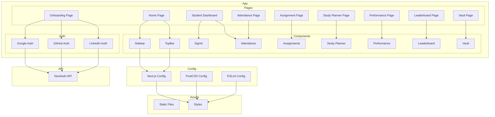

    

    <b>Automatic Architecture Diagrams from Code</b> 
    <a href="https://github.com/JashanMaan28/swark-continued">GitHub (Fork)</a> • <a href="https://github.com/swark-io/swark">Original Project</a>

## Usage Instructions

1. **Render the Diagram**: Use the links below to open it in Mermaid Live Editor, or install the [Mermaid Support](https://marketplace.visualstudio.com/items?itemName=bierner.markdown-mermaid) extension.
2. **Recommended Model**: If available for you, use `gemini` [language model](vscode://settings/swark-continued.languageModel). It can process more files and generates better diagrams.
3. **Iterate for Best Results**: Language models are non-deterministic. Generate the diagram multiple times and choose the best result.

## Generated Content
**Model**: GPT-4o - [Change Model](vscode://settings/swark-continued.languageModel)  
**Mermaid Live Editor**: [View](https://mermaid.live/view#pako:eNqFlE2PmzAQhv8K8nm3EpDvQyU-kt1IqxaJVS-mByeeAC3YCIzUaLX_vQZ7N9ihKqc8845nhtcT3tCZU0A7lLG8JU3hvMYZc-TT9ScVCJpGRYxoQnLobvHhCVz8zGsYpZ-W5OHv7MRJS0uWzyb4OBU9BSacmHTFmGqnLHAgBDBK2Hm-yRIHXVfmrB7KzCWsxiZXJ6kIY9DO5qxxAu2Ft_U_22zwCxAK7TjkbMYW_yB9dTeDnH3GyYjXDWdyZMvO0MVpSeFEWqt86OFX3oT3cemhfPsjs-NT42xt6llni5ZftmxYZYuGS7aoDfqvN0EvCvNo5OInzvMKRs2qG3n4qRTP_WlW9PFLyX4DPTJb_mw-_rD2P-LsUua35NjF3-CP-PKr09KkUOzhhHciStMZzcf7VE4gTGmupbwSmK7DXq6CIKI8O4eyguk17T2pXG-x2WrJ8XbgoKYfDBiE-2OB6zw-fpXbZ6Kn0Rsxck20VF-jr85auNC4MHGpcKlxpXClca1wrXGjcKNxq3CrMFQzx3rI0DMwUurhAz0TfQNjlbzXLxh7JvqfiB5QDfKfUFL5LX3LkCighgztnAxRuAzLnqF3mdQ3lAiISyLvpkY70fbwgEgveHpl5w9ueZ8XaHchVQfvfwH_wX-v) | [Edit](https://mermaid.live/edit#pako:eNqFlE2PmzAQhv8K8nm3EpDvQyU-kt1IqxaJVS-mByeeAC3YCIzUaLX_vQZ7N9ihKqc8845nhtcT3tCZU0A7lLG8JU3hvMYZc-TT9ScVCJpGRYxoQnLobvHhCVz8zGsYpZ-W5OHv7MRJS0uWzyb4OBU9BSacmHTFmGqnLHAgBDBK2Hm-yRIHXVfmrB7KzCWsxiZXJ6kIY9DO5qxxAu2Ft_U_22zwCxAK7TjkbMYW_yB9dTeDnH3GyYjXDWdyZMvO0MVpSeFEWqt86OFX3oT3cemhfPsjs-NT42xt6llni5ZftmxYZYuGS7aoDfqvN0EvCvNo5OInzvMKRs2qG3n4qRTP_WlW9PFLyX4DPTJb_mw-_rD2P-LsUua35NjF3-CP-PKr09KkUOzhhHciStMZzcf7VE4gTGmupbwSmK7DXq6CIKI8O4eyguk17T2pXG-x2WrJ8XbgoKYfDBiE-2OB6zw-fpXbZ6Kn0Rsxck20VF-jr85auNC4MHGpcKlxpXClca1wrXGjcKNxq3CrMFQzx3rI0DMwUurhAz0TfQNjlbzXLxh7JvqfiB5QDfKfUFL5LX3LkCighgztnAxRuAzLnqF3mdQ3lAiISyLvpkY70fbwgEgveHpl5w9ueZ8XaHchVQfvfwH_wX-v)

